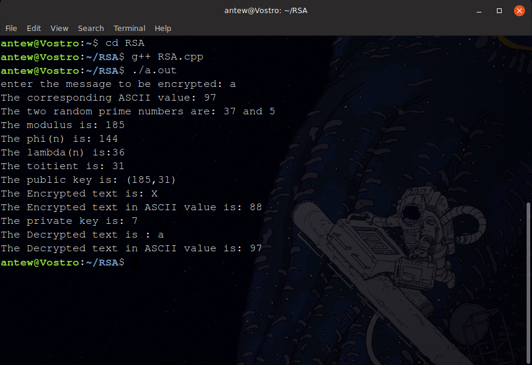

# RSA

This repository contains a dummy C++ code for RSA Cryptosystem.

## What is RSA ?

RSA (Rivest–Shamir–Adleman) is one of the first public-key cryptosystems and is widely used for secure data transmission. In such a cryptosystem, the encryption key is public and it is different from the decryption key which is kept secret (private).
You can read more about RSA[https://en.wikipedia.org/wiki/RSA_(cryptosystem)] here.

### Why Dummy code ?

While generating the random prime numbers , I have used primes numbers under 100, which is not secure enough and easy to crack. Whereas in real implementation the prime numbers chosen are really large (about 2 pages long :p). Also the random numbers generated by the system are not purely random they are pseudo random numbers. It takes integers as input (message) and encrypts the message by generating two random numbers then performing all the operations. It also genrates a private key which is complement to the public and it decrypts the ciphertext using it.
Currently it takes a character as input and encypts it using its corresponding ascii value and shows the encrypted text , then it calculates the private key using extended eucledian algorithm and decrypts the encrypted text to give the original message.

```
Give examples
```

### How to Use

First Fork and star this repository :p

Clone this repo using 
`git clone https://github.com/antew7/RSA.git`


Run the following commands on terminal

```
cd RSA
```
```
g++ RSA.cpp
```
```
./a.out
```



##Contribution
Anyone can contribute to this project just by cloning this repo and making PR on your branch.
PR will be merged if it improves the code and functionality.
If you find issues in the code or in functionality just create an issue and make a PR.


## License

This project is licensed under the MIT License - see the [LICENSE.md](LICENSE.md) file for details

